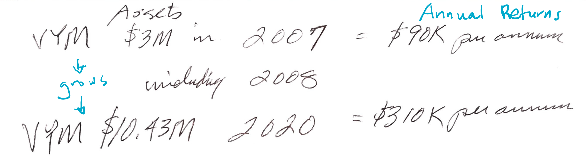

# My Investment Thesis

If you're reading this it's probably because I've asked you for investment advice. I combined all my thoughts, including notes taken our conversations, into this series of documents. I made this document for my use, but it may be valuable to you as well.

## What can you find here?

This contains a lay person's research and reasoning towards investments that:

- have reasonable yields for our current negative interest rate environment
- are significant inflation hedges, or
- are asymmetric bets (big upside, small downside)

It takes into account living in the Philippines and abiding to Philippine tax law. However, this should, for most part, be applicable to other citizens.

I've approached you for advice regarding traditional investments that yield interest, but because some of you might be interested, I will touch what I have invested in as well (namely bitcoin).

This is a work in progress, and will be updated as I learn more. You may find sections that are incomplete. Those are sections where I have to dig into more in order to put something sensible.

## What amount am I looking to invest?
The kind of of advice you give depends on the amounts a person is looking to invest. This document will contain investment vehicles that are applicable, but not limited to, investments from $10,000 to $5,000,000+.

## Investing

### Definition (not dictionary)

Investing is basically:

1. Theory explains behaviour of an instrument
2. Backtesting must support #1
3. Magic when #1 and #2 play out

This is solid advice I have gotten from one of you, but this write up will not include quantitive data.

### Rules of Thumb

1. Know timeframe. Plan out when you need funds back. Buying a house? That's a reason.
2. People get it wrong. Investment pros are on top of the market, but they're never right all the time.

## Vehicles

* [High Dividend Yield (VYM)](#high-dividend-yield-vym)
* [World Total Return (VT)](#world-total-return-vt)
* Corporate bonds
* Private Equity
* Bitcoin
* Gold

### High Dividend Yield (VYM)

Investing in VYM in 2007 before the Great Financial Crisis, would still have allowed $3M to grow to $10.4M in 2020, excluding the yield, which would have given you $90k per year in 2007 and $310k per year in 2020.

You may invest in [this](https://investor.vanguard.com/etf/profile/VYM) via [Saxo in Singapore](https://www.home.saxo/en-sg), which has the benefit of not paying taxes on profits until profits are brought back into the Philippines.

### World Total Return (VT)

Also [available](https://investor.vanguard.com/etf/profile/VT) via Vanguard.

### Corporate Bonds

Ayala, among other large corporations, offer corporate bonds. These currency yield 8% per year for a $200k investment.

Questions:
- What are the tax implications, since this is a Philippine instrument? Probably subject to 20% capital gains tax.

### Private Equity

These are like mutual funds but for private companies. Higher buy-in. Look into this more when more funds to spare.

### Bitcoin

Though bitcoin is a non-yielding asset, in the world of negative interest rates and central bank policies of flooding the economy with money, having a hard-capped supply (only 21 million bitcoins will exist, ever), immutable (your balance can't be changed like a bank can change your account balace), global (fairly liquid in many markets), and decentralized (no one controls it, censorship-resistant) store of value is increasingly being perceived as an insurance policy against inflation (or credit deflation if you will).

I'm bullish on bitcoin in the short term, and and in the long term. I owe you an explanation here, and I will put it on a [separate document](bitcoin.md).

### Gold

Gold is the original hedge against inflation, and has been recommended to me for some of the same reasons bitcoin is increasingly attractive. My concerns with gold are:

- verifiability
- third-party risk
